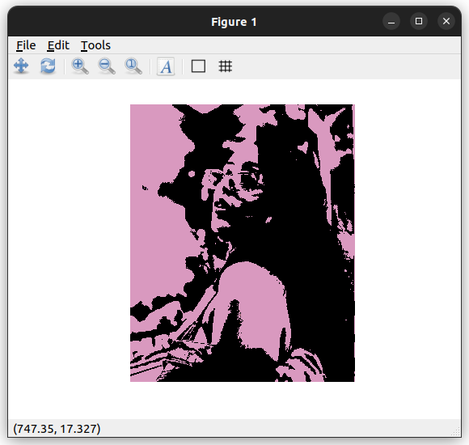

# ExplorationActivity1

## Octave Image Processing Exploration

### Question 1
- I used the **Image Processing package** for Octave

### Question 2
- You can rum my program by simply following the instructions the Octave GNU terminal will prompt you. Program works best if you follow the instuctions in order.

### Question 3
- My program serves the purpose of converting any *.jpg* image into a two colour scheme image. The program uses pixel intensity, the most intense being black, and the less intense pixels become whatever colour you chose.

### Question 4
- Sample input would be four integer values from 0 - 100 for red, green, blue and the colour vs black ratio. The program also needs you to choose a *.jpg* image from your files

